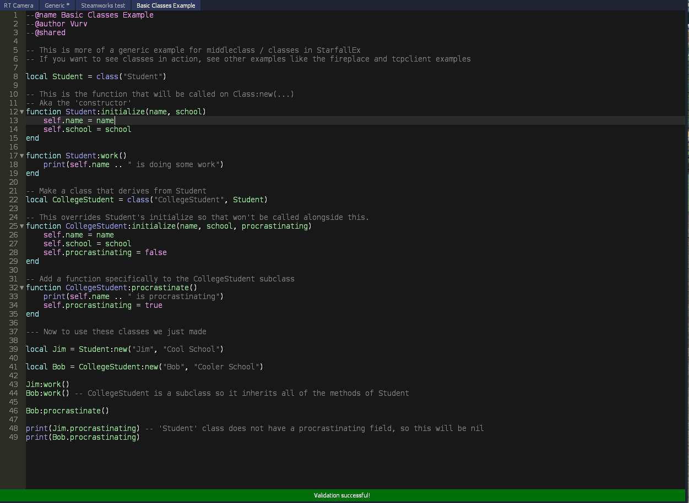

# SF-Themes
Textmate themes for Starfall

You can use any of the themes as a template and try and make your own theme to PR here.  
A lot of keys are specific and taken out for SF so I added comments as to what should be translated.

Note that the editor is missing support for a lot of things most notably a separate directive syntax color and an invalid syntax color.
_This makes these themes not completely faithful to what you might see in your own editors._

## Current List  
* VSCode Dark+
* Garrysmod Wiki
* Expression2

## Images

