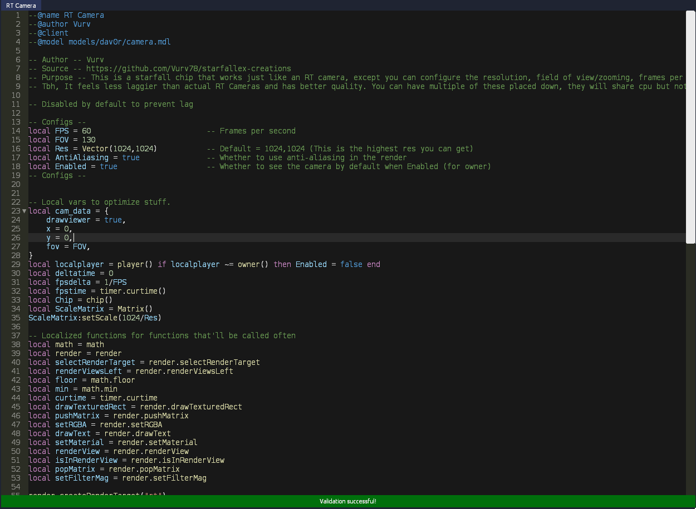

# SF-Themes
Textmate themes for Starfall

So far there's only a VSCode Dark+ theme, but that is a pretty good theme.  
Will do more when SF has the ability to get identifiers, error syntax and function arguments.  

You can use the VSCode Dark+ file and try and make your own theme to PR here.  
A lot of keys are specific and taken out for SF so I added comments as to what should be translated.

Current List  
* VSCode Dark+

